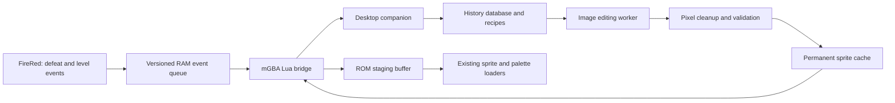

# FireRed gradual metamorphosis: design and implementation plan

**Superseded gameplay design:** The September 25 implementation uses explicit party-menu essence spending, EV caps and EV-weighted composition. See [README.md](README.md) for the current rules. The level-based formulas below are historical research.

Prepared September 23, 2026. Scope: a FireRed ROM hack running in an emulator with a desktop companion, as approved in this conversation. This document records the researched design. An experimental implementation has since been built and benchmarked; see [README.md](README.md) and [VALIDATION.md](VALIDATION.md) for its current status.

**Recommended design:** fork `pret/pokefirered`; keep battle mechanics and Pokémon records close to vanilla; record individual battle histories in the companion; generate a consistent front/back sprite pair for each level; inject validated graphics through a small, versioned RAM interface. Replace the visible evolution sequence with metamorphosis, while retaining normal species progression internally for stats and moves.

The two guarantees must be distinguished: the mathematical composition can be exact, but an image generator cannot guarantee that a creature is perceptually exactly 25% one species. Treat percentages as controlled design influence, with validation and a protected lineage identity.

**1. Source project and starting revision**

| Project | Finding | Decision |
| --- | --- | --- |
| [pret/pokefirered](https://github.com/pret/pokefirered) | Community C/assembly decompilation that builds English FireRed and LeafGreen variants. It includes graphics, evolution tables, build tools, and documented installation. | Use this as the base to minimize unrelated changes. |
| [cawtds/pokefirered-expansion](https://github.com/cawtds/pokefirered-expansion) | FireRed fork incorporating expansion features. | Consider only if expanded mechanics become a separate requirement. |
| [mgba-emu/mgba](https://github.com/mgba-emu/mgba) | Emulator with Lua scripting. | Use a pinned desktop build, with a Lua bridge and separate companion process. |

The inspected FireRed revision is [`c75f352304d529f6ba92d4f74b9cf8b5c3810788`](https://github.com/pret/pokefirered/tree/c75f352304d529f6ba92d4f74b9cf8b5c3810788). A source archive was downloaded and extracted under `research/source/pret-pokefirered-c75f352`. This is an archive snapshot, not a Git checkout. The available Git executable lacked its HTTPS helper, so the snapshot was retrieved through GitHub's API instead.

Terminology matters: this is publicly available reverse-engineered source, not an official source release. I found no repository-wide LICENSE file in the inspected snapshot; some bundled tools have their own licenses. Therefore I would not describe the whole game and its assets as permissively licensed open source. License review is a release prerequisite, and new companion code should carry an explicit license. This finding is about the repository contents, not a legal conclusion.

For implementation, create a fork and branch such as `codex/gradual-metamorphosis`. Follow the pinned [INSTALL.md](https://github.com/pret/pokefirered/blob/c75f352304d529f6ba92d4f74b9cf8b5c3810788/INSTALL.md). First build the unmodified FireRed target and compare its SHA-1 with the README's expected `41cb23d8dccc8ebd7c649cd8fbb58eeace6e2fdc`. Record the compiler, toolchain, commit, and emulator version before introducing hooks. The hacked build will intentionally have a different hash.

**2. Define what the feature changes**

Recommended first-release rules:

- Metamorphosis changes appearance. Defeated species do not grant their stats, types, moves, or abilities.
- Normal internal evolution remains responsible for balance, learnsets, Pokédex registration, and species names. Its visible cutscene is replaced by the metamorphosis presentation. At level 80, the starter can be mechanically Charizard even though its individual identity and appearance history began as Charmander.
- The reserved base share means the **lineage as it matures**, not a permanent minimum of 25% original Charmander. Otherwise the requested 25% Charizard example would not hold.
- Every earned level produces a composition snapshot and a generation job, including levels gained through Rare Candy and Day Care. Do not collapse several levels into one job. Initial capture/import creates an initial appearance, not an invented lifetime history.
- At level 100, history can continue to accumulate, but no further level-triggered sprite update occurs. A post-100 growth system would be a separate feature.
- Player-owned Pokémon receive custom graphics. Wild opponents, trainers' Pokémon, and species-level Pokédex images remain canonical. Individual front views in summary/PC and back views in battle are part of the target experience.
- Full-size sprites are the first milestone. Small party/PC icons can remain canonical initially; custom icons are an explicitly later deliverable.

If “instead of evolutions” must also remove all mechanical species changes, use an alternative mode that suppresses evolution eligibility and keeps the original species. It is simpler to suppress evolution than to retain all its effects silently, but a level-80 Charmander then retains Charmander's mechanics despite a Charizard-like picture. Smoothly interpolating stats and changing learnsets would be a substantially larger game-design project. The recommended mode avoids that scope increase.

**3. The weighting algorithm**

Keep a lifetime histogram for each individual Pokémon. Let:

- `L` = current level.
- `n_i` = credited defeats of species `i`.
- `N = sum(n_i)` = total credited defeats.
- `b = 0.25` = minimum lineage share.
- `K = 42` = resistance to early metamorphosis, measured in credited defeats.
- `t = clamp((L - 5) / 75, 0, 1)`.
- `r = t*t*(3 - 2*t)` = relative-mode weight, using smoothstep.

For `N > 0`, define two complete candidate distributions:

```text
Absolute-count donor share: A_i = (1 - b) * n_i / (N + K)
Relative-frequency share:   R_i = (1 - b) * n_i / N

Final donor share:          w_i = (1 - r) * A_i + r * R_i
Final lineage share:        w_lineage = 1 - sum(w_i)
```

For `N = 0`, explicitly return `w_lineage = 1` and all donor shares zero. There is no observed relative distribution to use.

An equivalent implementation separates total influence from its distribution:

```python
def weights(level, counts, resistance=42.0, base_floor=0.25):
    # Validate level, nonnegative finite counts, resistance > 0,
    # and 0 <= base_floor <= 1 at the configuration boundary.
    total = sum(counts.values())
    if total == 0:
        return 1.0, {species: 0.0 for species in counts}

    t = min(1.0, max(0.0, (level - 5.0) / 75.0))
    relative = t * t * (3.0 - 2.0 * t)
    absolute = total / (total + resistance)
    donor_mass = (1.0 - base_floor) * (
        (1.0 - relative) * absolute + relative
    )
    return 1.0 - donor_mass, {
        species: donor_mass * count / total
        for species, count in counts.items()
    }
```

At level 5, `r=0`: increasing the absolute number of defeats changes appearance even when the proportions stay identical. At level 80 and above, `r=1`: only relative frequencies matter. At every level the total is 100%, all weights are nonnegative, and lineage is at least 25% because donor mass is never greater than 75%.

“Absolute” here means a saturating count response, not an unlimited fixed percentage per defeat. Unlimited linear addition would eventually violate the 25% floor. The `N+K` denominator makes early defeats matter gently without an abrupt cap. Smoothstep gives exactly zero relative-mode weight at level 5 and exactly full relative-mode weight at level 80, with gentle changes near both endpoints.

Calibration is transparent: at level 5, three defeats should contribute 5%, so `0.75 * 3 / (3 + K) = 0.05`, giving `K=42`. At level 6 the tiny relative contribution raises this to 5.037%. Increasing `K` slows early mutation while leaving the level-80 result unchanged.

| Level | Pidgey defeats | Rattata defeats | Lineage | Pidgey | Rattata |
| --- | ---: | ---: | ---: | ---: | ---: |
| 5 | 3 | 0 | 95.00% | 5.00% | 0.00% |
| 6 | 3 | 0 | 94.96% | 5.04% | 0.00% |
| 16 | 10 | 20 | 66.20% | 11.27% | 22.53% |
| 36 | 50 | 100 | 35.31% | 21.56% | 43.12% |
| 50 | 100 | 200 | 28.24% | 23.92% | 47.84% |
| 65 | 200 | 400 | 25.51% | 24.83% | 49.66% |
| 80 | 500 | 1,000 | 25.00% | 25.00% | 50.00% |

Rows are illustrative histories, not an XP simulation. Keep full precision internally; round only for display. If integer basis points are needed, use largest-remainder allocation so rounded shares still sum to 10,000.

The key balance consequence is unavoidable under a strictly relative endpoint: at level 80, one recorded Pidgey defeat and 1,000 recorded Pidgey defeats both produce 75% Pidgey. Rare Candy and Day Care make that edge case reachable. If playtesting rejects this, an optional confidence factor `q=min(1,N/20)` can multiply donor mass. That would deliberately relax the requirement that level-80 composition be independent of total defeats. Do not silently introduce it into the default formula.

**4. Make the lineage itself gradual**

Read evolution thresholds from the game's [evolution table](https://github.com/pret/pokefirered/blob/c75f352304d529f6ba92d4f74b9cf8b5c3810788/src/data/pokemon/evolution.h). The inspected Charmander line uses 16 and 36.

The strict example-compatible baseline is Charmander through level 15, Charmeleon at 16–35, and Charizard from 36. For the actual gradual presentation, interpolate the lineage over the final six levels before each threshold:

```text
q = smoothstep(clamp((L - (evolution_level - window)) / window, 0, 1))
lineage(current stage) = w_lineage * (1 - q)
lineage(next stage)    = w_lineage * q
```

For Charmander, use windows 10–16 and 30–36. At level 6 it is entirely Charmander within its lineage share; at 13 it is half Charmander and half Charmeleon; at 16 it is entirely Charmeleon; at 33 it is half Charmeleon and half Charizard; at 36 it is entirely Charizard. Donor shares are unaffected. This satisfies both worked examples while allowing future evolution traits to appear early.

Short evolution intervals require shorter windows: cap each window by the distance from the previous threshold, preventing overlapping transitions. Do not assign a level to stone, friendship, trade, or branching evolution without an explicit rule. Initially support ordinary level-based Kanto lines. For later expansion, an item or friendship event unlocks a chosen lineage destination and begins a documented transition; trade lines need an in-game substitute because link trading is outside the first release. Persist branch choices. Respect Everstone/evolution cancellation and eligibility gates; a blocked transition must not silently become mechanically evolved. If anticipated future traits are allowed before a cancelled evolution, freeze the visual transition until it is unlocked again and explain this as cosmetic anticipation.

When a donor is also a lineage species, retain separate bookkeeping roles, then combine identical species references for rendering. The protected lineage budget still exists independently.

**5. What counts as a defeated Pokémon**

Recommended default: award one full defeat credit to each non-fainted party member that participated against the defeated opponent. This uses an existing participation mask and avoids inventing unreliable final-hit attribution. Two participants can each receive one credit; histories are individual and are not a conserved team currency.

- Exp. Share alone gives levels but no appearance credit. This makes “what this Pokémon fought” meaningful. An alternative XP-recipient policy is easy to configure later.
- Count a resolved opponent faint once. Poison, weather, recoil, and other indirect defeats use the same participation rule.
- Use the opponent's original species from its enemy-party record, not a temporary transformed battle sprite. Ditto remains a Ditto donor.
- Catching, escaping, and the capture tutorial give no defeat credit. Exclude link battles, Safari battles, and special facilities in the first release.
- A later blackout does not erase earlier credited defeats if their earned experience remains in the game state.
- An actual new faint after an opponent revival is a new event; repeated frames processing the same faint are not.
- Record all supported species, without discarding infrequent ones. Version species-ID mappings against the ROM; internal IDs must not be assumed to equal National Dex numbers.
- A newly caught, hatched, or imported Pokémon starts with no known defeats. Do not synthesize battle history from EVs, level, or experience.

**6. Sprite generation: use constrained image editing**

| Method | Advantages | Limitations | Role |
| --- | --- | --- | --- |
| Pixel averaging | Simple, exactly weighted numerically | Produces ghosted outlines and mixed colors rather than coherent anatomy | Diagnostic baseline only |
| PCA/eigenvector blending | Compact linear representation | A PCA basis describes variance across aligned images, not meaningful interchangeable creature parts | Research experiment, not the first implementation |
| Authored part compositor | Fast, reproducible, measurable region allocation | Requires compatible anatomy masks and a curated parts library | Reliable fallback and useful structure guide |
| Reference-guided image editing | Can synthesize coherent anatomy and combine visual motifs | Approximate control, variable latency, front/back inconsistency | Recommended main generator |

A weighted sum of PCA coordinates reconstructs a corresponding linear image mixture (or a truncated approximation); PCA alone does not solve anatomical alignment. A learned nonlinear latent representation may be useful, but arbitrary embedding interpolation is an experiment, not a proven sprite-fusion engine.

Build a provider-neutral interface around image editing with multiple references. A concrete local candidate to test is an SDXL-compatible image-to-image pipeline with IP-Adapter for image guidance and ControlNet for silhouette/edge guidance. Diffusers documents [multiple references and spatial masks](https://huggingface.co/docs/diffusers/using-diffusers/ip_adapter) and [structural conditioning](https://huggingface.co/docs/diffusers/using-diffusers/controlnet). These are building blocks; neither documentation nor this plan establishes that the combination meets this project's art requirements. Benchmark before selecting a model, GPU requirement, or cloud provider.

Proposed generation stages:

1. Assemble a versioned recipe containing identity, level, full histogram digest, exact shares, lineage transition, original sprites, last accepted sprite pair, model version, seed policy, and render settings.
2. Build a feature brief that maps each species to silhouette, appendages, ears, wings, tail, surface markings, palette, and texture. Keep these assignments stable across levels to prevent traits jumping between body regions.
3. Establish structure using the lineage skeleton and a protected identifying region. Donor weights influence available feature regions; masks can enforce a minimum reserved area, but protected pixel area is not the same as guaranteed semantic identity.
4. Feed the current/next lineage references and strongest donor references to the image editor. Use the previous sprite for continuity and canonical references to prevent accumulated drift.
5. Generate a front view and an anatomically matching back view. Prefer a consistent two-view sheet if the chosen model handles it; otherwise generate the back with the accepted front plus the shared trait map. A back view is not a mirror of a front view.
6. Work at the model's useful resolution, then fit and pixel-clean to a 64×64 canvas per view. Do not assume that asking for “pixel art” guarantees usable low-resolution pixels.
7. Remove backgrounds, enforce binary alpha, align baselines, clean stray pixels, quantize the two views together, and convert to GBA tiles and palette data.
8. Validate the pair, retry with a bounded budget if necessary, and cache accepted bytes permanently. Keep the previous accepted appearance if generation fails.

For temporal stability, use a per-individual base seed, persistent feature placement, and modest editing strength guided by the change in recipe. A fixed seed alone does not guarantee continuity. A new job is scheduled at every level even when no defeats have been added. At high levels, changes may be subtle; do not add large random mutations just to make every frame visibly different.

All defeated species remain in the mathematical recipe. For large histories, pass, for example, the four strongest donors explicitly and aggregate the remainder into a weighted trait vector or motif atlas. Preserve the residual mass rather than renormalizing the top four to 100%. The residual affects palette/markings and secondary features. Weighted image-embedding aggregation is another candidate to benchmark, not a guaranteed substitute. At 64×64 it is impossible to promise a separately recognizable feature for hundreds of donors; if that literal interpretation is required, the artistic requirement must change.

Example image-editing brief for the level-80 case:

```text
Create two matching battle views of one individual creature: front and back.
Target design influence: Charizard lineage 25%, Pidgey 25%, Rattata 50%.
Use the attached reference sprites and the previous accepted two-view sprite.
Keep the established pose, baseline, feature placement, and individual identity.
Preserve the lineage's draconic structure and identifying flame-tail feature.
Apply Rattata influence through ears, muzzle, fur, and tail contour;
apply Pidgey influence through feather patterning and wing texture.
Use one coherent anatomy, a clean silhouette, strong pixel-art clusters,
and consistent markings and colors in both views.
No lettering, scenery, ground shadow, extra creatures, or detached body parts.
Final export will be 64x64 pixels per view with one shared 15-color opaque
palette plus transparency. Percentages are target influence, not opacity.
```

At level 6, the corresponding instruction is “retain the Charmander silhouette and identity; introduce only a subtle Pidgey feather or marking accent, about 5% influence.” Use masks and reference strengths as well as the prompt. Do not interpret a model's conditioning scale as a calibrated species percentage.

**7. Runtime architecture and level-up flow**



The [mGBA scripting API](https://mgba.io/docs/scripting.html) documents frame callbacks, memory reads/writes, and Lua TCP sockets. Use a loopback connection to the companion; run image generation in a separate worker. Socket connection setup can block, so establish it before gameplay and keep per-frame work bounded. The documented byte/word write methods are sufficient for a first bridge; do not assume a bulk `writeRange` method exists.

Recommended event flow:

1. FireRed emits a defeat event with original enemy species, eligible participant identities, and a monotonically increasing sequence number.
2. The bridge sends it to the companion. The companion durably commits the event before acknowledging it. Duplicate deliveries are idempotent.
3. After the corresponding experience actually produces a level, FireRed emits a separate level event. Its recipe snapshot includes all earlier committed defeats, including the defeat that caused the level.
4. The companion computes exact weights and queues one front/back job per earned level. Multiple levels from one opponent share the appropriate history prefix but have distinct levels and recipe keys.
5. The old sprite stays valid while the job runs. Once a pair passes validation, the bridge writes a staging buffer, then publishes a ready flag last.
6. The ROM validates identity, recipe revision, branch, payload lengths, and checksum, and applies it at a safe graphics update point using its existing tile/palette machinery.
7. Never apply a late level-7 result over an already applied level-8 result. Keep earlier results in the history gallery even when they were never displayed in battle.

The default is asynchronous generation: every level triggers a job, but the new image appears when ready. If the requirement is that the new sprite must appear before play resumes, add an optional strict mode that waits in a metamorphosis scene. It must time out to the last good sprite on generation failure. Those are distinct experiences; generation latency is not assumed to be instantaneous.

Refreshing the active Pokémon needs an explicit safe refresh path. Updating a disk cache or a species pointer only changes later loads; it does not automatically replace pixels already displayed. Avoid updates while Transform, Substitute, or an animation temporarily owns that battler's graphics. Queue the refresh until the ordinary appearance is restored. Preserve normal fade/flash palette behavior.

The ROM-facing interface should expose proposed functions such as:

```c
Meta_RecordDefeat(...);
Meta_RecordLevelUp(...);
Meta_PollBridge(void);
Meta_TryLoadSprite(...);   /* bool: use vanilla path on false */
Meta_CommitReadySprite(...);
```

These are new proposed APIs, not existing upstream symbols. Generate bridge addresses and struct layouts from the build's ELF/map rather than hardcoding addresses found on the internet. Handshake on a protocol version and build ID before any RAM writes.

Use a bounded event ring with explicit backpressure and acknowledgments. It must not silently overflow during fast-forward, disconnected operation, or large Day Care withdrawals. In strict tracking mode, pause at a safe boundary while the companion reconnects. A declared vanilla fallback can permit play without tracking, but missing history then cannot be reconstructed; do not present that mode as fully equivalent.

**8. Graphics format and memory budget**

Export ordinary sprites as one 64×64 front view and one 64×64 back view. The game's [graphics tables](https://github.com/pret/pokefirered/blob/c75f352304d529f6ba92d4f74b9cf8b5c3810788/src/data/pokemon_graphics/front_pic_table.h) and [graphics conversion rules](https://github.com/pret/pokefirered/blob/c75f352304d529f6ba92d4f74b9cf8b5c3810788/graphics_file_rules.mk) are the implementation references; special forms require separate handling.

For the proposed single-frame export:

- 4 bits per pixel: `64 * 64 / 2 = 2,048` bytes per view.
- 16 palette entries, with index 0 transparent and at most 15 visible colors.
- One shared 16-entry GBA RGB555 palette: 32 bytes.
- One raw pair: `2,048 + 2,048 + 32 = 4,128` bytes, excluding metadata.
- Six pairs: 24,768 bytes, before staging, event queues, and existing engine allocations.

These figures are payload arithmetic, not a claim that the ROM has that much spare RAM. First inspect the linker map and peak heap usage. Start with the currently displayed back views and one requested front view plus staging; keep the complete collection on desktop disk. Consider a six-member cache only after measuring capacity.

Use raw tiles for the first prototype and copy into the existing decompressed graphics buffers. Do not pass raw tile bytes to an LZ decompressor. Tile order, palette byte order, alignment, dimensions, transparency, view orientation, and screen offsets must be verified against a known canonical sprite before testing generated art. If a rendering path expects multiple frames, duplicate the static frame or give the custom sprite a one-frame animation definition.

Front/back views must share the same palette mapping, not just the same set of approximate colors. Quantize jointly. Shiny individuals need a defined policy: preserve shininess as a persistent style input and produce a validated shiny palette/appearance. A donor's shiny status should not turn the recipient shiny. Validate species flip rules, vertical offsets, attack flashes, and affine animation behavior so a new silhouette is not clipped or mirrored incorrectly.

**9. Small, concrete changes to FireRed**

The following locations were inspected in the pinned source. Line numbers are starting points in that revision; use symbol names when implementing.

| Existing file / symbol | Proposed change | Why it is needed |
| --- | --- | --- |
| [battle_script_commands.c:3113, `Cmd_getexp`](https://github.com/pret/pokefirered/blob/c75f352304d529f6ba92d4f74b9cf8b5c3810788/src/battle_script_commands.c#L3113) | Emit a once-per-faint defeat event in the accepted experience path; capture participation and original enemy identity before recipient iteration. Emit a level event in the confirmed `RET_VALUE_LEVELED_UP` branch. | Avoid frame polling, duplicate credits, and missing intermediate levels. |
| [party_menu.c:5043, `ItemUseCB_RareCandyStep`](https://github.com/pret/pokefirered/blob/c75f352304d529f6ba92d4f74b9cf8b5c3810788/src/party_menu.c#L5043) | Emit one level event after successful Rare Candy application. | This path is outside battle experience. |
| [daycare.c:478, `ApplyDaycareExperience`](https://github.com/pret/pokefirered/blob/c75f352304d529f6ba92d4f74b9cf8b5c3810788/src/daycare.c#L478) | Record each successful iteration of level growth; buffer safely before the temporary Pokémon is moved into the party. | Preserve every earned level even when several are materialized at withdrawal. |
| [battle_gfx_sfx_util.c:368, `BattleLoadPlayerMonSpriteGfx`](https://github.com/pret/pokefirered/blob/c75f352304d529f6ba92d4f74b9cf8b5c3810788/src/battle_gfx_sfx_util.c#L368) | Consult an individual sprite override, load matching tiles/palette, otherwise retain the original code path. Add an active-battler refresh entry point. | Player back sprites must differ between individuals of the same species. |
| [pokemon_summary_screen.c:4007, `PokeSum_CreateMonPicSprite`](https://github.com/pret/pokefirered/blob/c75f352304d529f6ba92d4f74b9cf8b5c3810788/src/pokemon_summary_screen.c#L4007) and `trainer_pokemon_sprites.c` | Carry individual identity into a custom front-sprite loading path, with canonical fallback. | Summary includes both party and boxed individuals. |
| `pokemon_storage_system_data.c` | Add the same resolver to the selected individual's large PC portrait and palette. | PC has a separate display path. Small icons are a later phase. |
| [evolution_scene.c:634, `Task_EvolutionScene`](https://github.com/pret/pokefirered/blob/c75f352304d529f6ba92d4f74b9cf8b5c3810788/src/evolution_scene.c#L634) | Replace the presentation while preserving eligibility, species/stat updates, naming, Pokédex effects, move learning, cleanup, and special evolution side effects. Emit a stage-change notification. | Deleting this scene without preserving its transaction breaks mechanics. |
| [battle_main.c:3880, `TryEvolvePokemon`](https://github.com/pret/pokefirered/blob/c75f352304d529f6ba92d4f74b9cf8b5c3810788/src/battle_main.c#L3880) | Prefer retaining the existing caller; make only coordination changes needed for metamorphosis presentation and pending jobs. | Avoid redesigning battle-exit state machines. |
| `main.c` frame callback path, selected after profiling | One bounded bridge poll/commit hook. | Receives ready assets and services events without blocking battle logic. |
| `include/global.h`, `save.c`, new-game initialization | A small versioned history checkpoint record and save coordination. | Connect normal saves to the external event history. |

Add `src/metamorphosis.c`, `include/metamorphosis.h`, a configuration flag, and a generated bridge manifest. Keep the histogram, floating-point math, model clients, image encoding, and permanent cache in the companion.

Do not globally replace `gMonFrontPicTable[species]` or `gMonBackPicTable[species]`: that would make every Pokémon of that species share the same mutation. Do not enlarge `struct Pokemon` or `struct BoxPokemon`, whose encrypted/checksummed data layout is used throughout the game. Do not assume the generic decompressor knows the owner; the inspected loader often receives species and personality but not full identity. Start with explicit call-site overrides, then factor shared helpers after behavior is proven.

The evolution change is the most invasive part of the minimal patch. In the inspected code, the scene itself applies species changes and triggers move learning. Preserve and test those operations instead of merely skipping `EvolutionScene()`. Cosmetic anticipation can precede the mechanical milestone, but the companion must reconcile after the stage-change event so a queued recipe cannot ignore a cancelled or newly committed evolution. Preserve ordinary post-battle evolution timing; evolving mid-battle would change more mechanics.

**10. Persistence, individual identity, and rollback**

Use a sidecar SQLite database plus immutable image files. A proposed schema is:

```text
campaigns(campaign_uuid, rom_build_id, schema_version)
individuals(uuid, campaign_uuid, ot_id, personality, immutable_fingerprint)
branches(branch_uuid, parent_branch, fork_event)
events(branch_uuid, sequence, kind, individual_uuid, payload)
recipes(hash, individual_uuid, level, branch_uuid, history_digest, config_versions)
assets(recipe_hash, front_path, back_path, palette_path, content_hash, status)
checkpoints(checkpoint_uuid, branch_uuid, event_sequence, save_digest)
```

Keep the full event log and derive histograms from it. Histograms are caches, not the only surviving history. Events are unique by branch and sequence; processing the same event twice cannot increase counts twice.

Use campaign ID + original trainer ID + personality as the primary lookup fingerprint, with immutable origin fields as collision checks and an external UUID as the database identity. Never use party slot, nickname, species, level, or file path as permanent identity. Party sorting, boxing, renaming, and evolution must not change history. OT/personality is not a mathematically unique identifier: identical clones and ambiguous imports must be detected, not silently merged. Support normal movement of existing individuals first; defer cloning and external trade/import reconciliation until there is an explicit policy.

For robust ordinary saves, reserve approximately 32 bytes for a magic value, schema version, campaign ID, branch/checkpoint reference, and event cursor. A concrete candidate is a documented slice of `SaveBlock2.filler_B20[0x400]`, visible in [global.h](https://github.com/pret/pokefirered/blob/c75f352304d529f6ba92d4f74b9cf8b5c3810788/include/global.h). It must be audited for direct and indirect use, initialization, compatibility, and checksumming before reuse. Preserve struct size and all later offsets; “filler” is a candidate, not proof that arbitrary bytes are safe. Do not reuse the tiny unknown field inside each Pokémon record as an undocumented ID.

Save protocol: flush/acknowledge history before a game-save checkpoint is committed; write a versioned checkpoint reference with the ordinary save; retain prior checkpoints until save success is confirmed. Audit the different save entry paths rather than assuming one function handles every case. If the reserved-space audit fails, use explicit companion-managed save bundles as the fallback design instead of guessing at unused storage.

mGBA save states also contain live RAM. Keep the event cursor and active branch marker there. On state load, reconcile the restored cursor with the sidecar, restore the matching history prefix, then fork a new branch for new events. Do not apply future defeats to a restored past state. A stale image response must carry enough branch/recipe identity to be rejected. Disable emulator rewind in the first release unless equivalent rollback handling has been proven; support explicit save-state loads as a tested requirement.

Ship a backup/export operation that packages the game save, database checkpoint, configuration, and accepted assets. A `.sav` by itself does not contain the full battle history or images. If a sidecar is missing, use canonical/last available artwork and clearly indicate that the historical data is unavailable. Restoring old saves, campaign duplication, and crash recovery are core correctness tests, not polish.

Cache keys should include the full normalized recipe, histogram digest, lineage policy, prior accepted asset hash if used as input, model/version, generation settings, seed, palette/export version, and shiny policy. Model APIs and GPU kernels may not reproduce identical images from a seed alone; persist accepted output bytes rather than relying on regeneration.

**11. Implementation milestones and acceptance gates**

| Phase | Work | Exit criterion |
| --- | --- | --- |
| 0. Reproducible baseline | Fork/pin source; build stock ROM; pin mGBA; record toolchain; inspect RAM map and save-space candidate. | Stock hash matches; baseline save/load works; memory and save metadata strategy are explicit. |
| 1. Math and recipe prototype | Implement histogram rules, weighting, lineage windows, identity lookup, and recipe serialization in the companion. | Examples match; invariant/property tests pass; outputs are versioned and deterministic before image generation. |
| 2. Graphics bridge proof | Manually prepared sprite pair, RAM handshake, staged transfer, player back view and summary front view. | Two same-species individuals show different correct images simultaneously/in sequence; palettes and repeated loads remain sound. No AI required yet. |
| 3. Exact event history | Defeat, battle-level, Rare Candy, Day Care, duplicate suppression, and durable acknowledgments. | One defeat causes exactly the intended credits; all earned levels generate distinct recipes; fast-forward loses no events. |
| 4. Persistence | Save checkpoint, sidecar, campaign IDs, boxing, restore, branch rollback, crash recovery. | Save/load and restoring an older state reproduce the correct history without future contamination. |
| 5. Art pipeline | Benchmark candidate image editors, stabilize paired views, quantize/export, add validation, cache and bounded retries. | A fixed evaluation set passes agreed art criteria; actual latency/cost/rejection rates are measured. |
| 6. Metamorphosis presentation | Replace visible evolution scene while retaining effects; apply generated changes at safe points; add PC portrait support. | Play through levels 16 and 36, moves, cancelled evolution, item gating, and scene return without regressions. |
| 7. Broaden coverage | More lineages, special forms, shiny policy, branch rules, optional custom icons, distribution package. | Compatibility matrix passes and documented limitations match actual behavior. |

The first playable vertical slice should be one Charmander-line individual, Pidgey/Rattata donors, ordinary single battles, front/back views, and persistent history. Expansion to all species is a later scope gate, not a reason to delay validating the bridge and art quality.

Use the following focused acceptance tests:

- Mathematical: zero defeats; level boundaries 1/5/6/79/80/100; nonnegative weights; exact sum; 25% floor; equal-ratio histories identical at 80; same ratios with more defeats stronger below 80; smooth lineage completion at 16/36. The plan's formula was checked across 600 level/history cases and both user examples, but that does not test ROM integration.
- Attribution: switches, double battles, poison/recoil, revived enemies, fainted participants, Exp. Share, level 100, multiple levels from one KO, loss after an earlier KO, and transformed opponents.
- Persistence: party reorder, PC deposit/withdrawal, nickname/species changes, save failure, application crash, duplicate messages, older save-state restore, campaign copy, missing sidecar, and collision detection.
- Graphics: front/back coherence, palette index 0, exactly sized tile buffers, two same-species battlers, image arrival during animation, stale result ordering, cache eviction, shiny palettes, screen flips, Transform/Substitute fallback, and malformed/truncated payloads.
- Evolution: preserve nickname behavior, stat recalculation, Pokédex flags, level-up/evolution move learning, HM replacement rules, cancellation, Everstone, National Dex restrictions, and special cases before broadening species support.
- Service failure: companion disconnect, model timeout/refusal, invalid image, disk full, bounded retries, event-ring backpressure, and recovery using the last accepted sprite.

For image quality, evaluate at least 20 fixed recipes spanning low/high influence and two very different silhouettes. Score recognizable lineage, ordered donor prominence, front/back agreement, adjacent-level continuity, and readability at native 64×64. Mathematical validation cannot replace this visual evaluation.

No generation cost or speed is assumed. If there are `J` level events and an average of `a` billable requests per accepted pair, cost is `J * a * measured_cost_per_request`; measure retries and paired-versus-separate view requests. One individual from level 5 to 80 creates 75 level jobs; six such individuals create 450. Keep model concurrency bounded and show backlog in the companion. In strict mode, that backlog becomes player wait time.

**12. Deliverables and limits of this planning work**

This section describes the original planning deliverable. An experimental implementation has since been added; see [README.md](README.md) for the current build, launcher, and limitations. The accompanying interactive explorer still displays mathematical composition only.

Implementation should produce: the small feature-gated ROM patch, reproducible build instructions and bridge manifest, Lua bridge, desktop companion, versioned schema and migration rules, generation recipes, sprite converter/validator, cache and export tooling, acceptance fixtures, and a compatibility document. Package the hack as a patch plus its companion and build instructions, with third-party licenses reviewed before release.

The largest unresolved engineering questions are model fidelity/latency, safe available RAM, save-checkpoint integration, and preserving all evolution side effects while changing presentation. The plan places explicit prototypes and acceptance gates ahead of broad implementation so each is resolved with evidence.

**Implementation notes, 23 September 2026:** The prototype uses local Stable Diffusion 1.5 through stable-diffusion.cpp Vulkan, an immutable SQLite history graph, a 32-byte SaveBlock2 checkpoint, and a loopback mGBA Lua bridge. Protocol 3 keeps 128 events and two bank references in a 4,760-byte RAM bridge, preserving a 108 KiB game heap. Sprite payloads live in three dedicated emulator-patched ROM banks. Earlier six-pair and two-pair EWRAM caches exhausted the heap during battle initialization. All generated assets remain on disk; the ROM prioritizes the displayed individual and active battlers. Read the validation report for measured results and untested cases. This implementation is experimental rather than a finished compatibility release.

**Anatomical artwork revision:** The implemented renderer now uses 386 hand-authored species profiles, a weighted anatomical design compiler, and separate front/rear generation through the free DreamShaper 8 checkpoint. It removes the earlier donor-pixel collage entirely. Simple connected sketches guide body structure; image prompts describe inherited anatomy rather than listing Pokémon names and percentages. Trait contents and compiled designs are included in cache keys. The existing ROM protocol and level weighting are unchanged. See the updated [README](README.md), [trait vocabulary](companion/data/traits.tsv), and [example gallery](build/anatomy-final/README.md). Image-model adherence, exact donor prominence, and front/rear consistency remain experimental.
